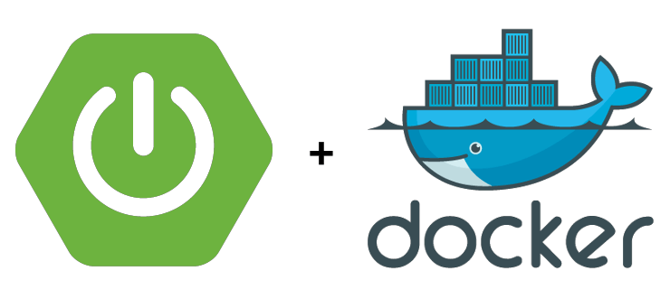

# Docker Spring Boot Sample

## Documentation

* [Docker compose](#docker-compose-file)
* [Run project by Docker Compose](#run-project-by-docker-compose)
* [How build and run image](#how-build-and-run-single-image) 
* [How stop container](#how-stop-container)
* [Remove container](#remove-container)
* [How remove image](#how-remove-image)
* [Dockerfile](#dockerfile)
* [Additional commands](#additional-commands) 

## Docker Compose file

In that case we use a docker compose in the third version. We use existing dockerfile to run image.

```yaml
    version: "3"
    
    services:
      spring:
        ports:
          - "8080:8080"
        build:
          context: ./
          dockerfile: Dockerfile
```

## Run project by Docker Compose

To run this image we will use below command.

```bash
    docker-compose up
```

Everytime when we will use docker compose command to run app, docker will use the existing image and container, to rebuild that we should use below command.

```bash
    docker-compose up --build
```

This solution not always work properly 

## How build and run single image

To build Docker image from Dockerfile use below command. Option -t allow adding own tag name from the image. Dot at the end of command means that Docker will try find Dockerfile in a current folder.

```
    docker build -t springsbs .
``` 

Then we can check that image was created. We use image command to display all created images.

```
    docker images
```

To run create image on port 8080 we use below command. Parameter -p means port, value before ':' is a target host port. If we skip this parameter, then we lose possibility to get access to application by http. We must map container port to host port, even if they are the same.

```
    docker run -p 8080:8080 springsbs
```

## How stop container

If we want stop container we must use second terminal and use there stop command (before that we must show working containers to get container ID).

```
    docker ps
    docker stop <few first chas from CONTAINER ID>
```

## Remove container

If we want remove stopped container we must display all used or not used containers (first command) and then use rm parameter.

```
    docker ps -a
    docker rm <few first chas from CONTAINER ID>
```

## How remove docker image

If we want show all images in our Docker instance we must use below command.

```
    docker images
```

If we want delete one of them then we can use

```
    docker image rm <IMAGE ID>
```

If we want remove not used images then better will be next command.

```
    docker image prune -a 
```

## Dockerfile

* Line 1: The FROM instruction initializes a new build stage and sets the Base Image for subsequent instructions.
* Line 2: The RUN instruction will execute any commands in a new layer on top of the current image and commit the results. The resulting committed image will be used for the next step in the Dockerfile.
* Line 3: Set user and group (in this case we set up it for Spring in last step).
* Line 4: ARG instruction defines a variable that users can pass at build-time to the builder with the docker build command using the --build-arg <varname>=<value> flag. If a user specifies a build argument that was not defined in the Dockerfile, the build outputs a warning.
* Line 5: The COPY instruction copies new files or directories from src and adds them to the filesystem of the container at the path dest. (COPY src dest)
* Line 6: An ENTRYPOINT allows you to configure a container that will run as an executable. (ENTRYPOINT command param1 param2)

```Dockerfile
    FROM openjdk:8-jdk-alpine
    RUN addgroup -S spring && adduser -S spring -G spring
    USER spring:spring
    ARG JAR_FILE=target/*.jar
    COPY ${JAR_FILE} app.jar
    ENTRYPOINT ["java","-jar","/app.jar"]
```

## Additional commands

Parameter -it run container in an interactive mode, is possible use ctrl+c to stop container.

```
    docker run -it -p 8080:8080 springsbs
```

Parameter -d (must be before 'p' responsible for port binding), detach logs from terminal and create possibility to do some other actions after run container in one terminal. 

```
    docker run -dp 8080:8080 springsbs
```

If we detach from running container, and we want see logs from there we can use below command. If we add -f parameter then we will stay connected, and we will see all new logs.

```
    docker logs <CONTAINER ID>
    docker logs <CONTAINER ID> -f
```

Below command works only for an image where we have linux system. We can use this when we want connect to system and do some actions in the container.

```
    docker exec -it <CONTAINER ID> /bin/bash
```

Remove unused images.

```
    docker image prune -a
```
